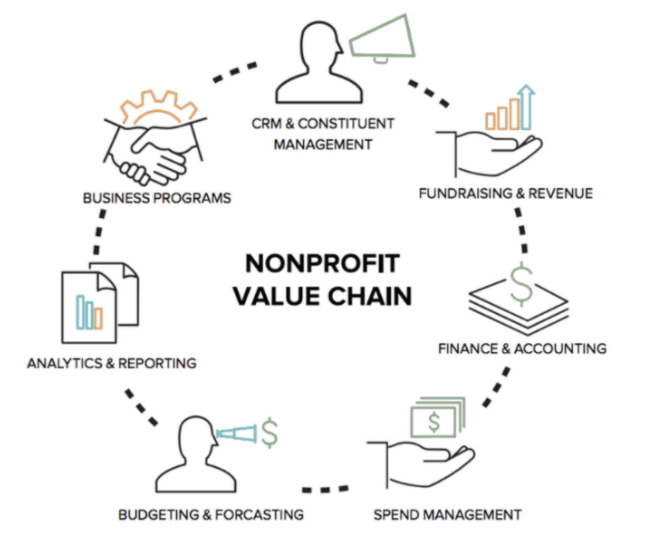

# NGO ENTERPRISE RESOURCE PLANNING (ERP) SYSTEM

## Developer: Nash The Coder

## What Is Enterprise Resource Planning (ERP)?
Enterprise Resource Planning (ERP) is a process used by organisations to manage and integrate the important parts of their processes. Many ERP software applications are important to organisations because they help them implement resource planning by integrating all of the processes needed to run their organisations with a single system. An ERP software system can also integrate planning, purchasing inventory, sales, marketing, finance, human resources, and more.

## Key Benefits
ERP software can integrate all of the processes needed to run an organisation.
ERP solutions have evolved over the years, and many are now typically web-based applications that users can access remotely.
Some benefits of ERP include the free flow of communication between business areas, a single source of information, and accurate, real-time data reporting.

## Client Business Requirements
Digitization the finance and accounting process of requisition and payments and budget updates based on expense.
Provision of digital access of the Client's Standard Operation Policies to allow for reading , updating and downloading pdf versions by Staff.

## User Stories
[User story notes 1](https://www.agilebusiness.org/page/ProjectFramework_15_RequirementsandUserStories)
[User story notes 2](https://www.clariontech.com/blog/how-to-break-down-the-requirements-for-an-agile-project-management)

## Tech Stack: NodeJS, ReactJS and MongoDB

## MVP Features

### Registration System

 - User Registers for the App via email
 - Send email for email address verification
 - Resend email when users don't receive it
 - Activate Account when email link is clicked

### Authentication System

 - User login
 - User logout

### Password System

 - Send email for Forgot Password
 - Allow password reset after clicking on email link

### Email Integration

 - Mailgun API Integration
 - Ability to create, edit and send HTML template based emails

### Create Requisitions

 - Ability to create, edit, sign and submit Requisition Form.
 - Ability to approve Requisition.
 - User notification

### Generate Payment Voucher

 - Ability to create, edit, sign and submit Payment Form.
 - Ability to approve Payment.
 - User notification

### Create Policy Document

 - Ability to create, edit , review and submit Policy Document in PDF version.
 - User notification

---

## Future Features

### User activity tracker

### Automates Report generations

# Resources:

[Markdown Cheat Sheet](https://www.markdownguide.org/cheat-sheet/)
